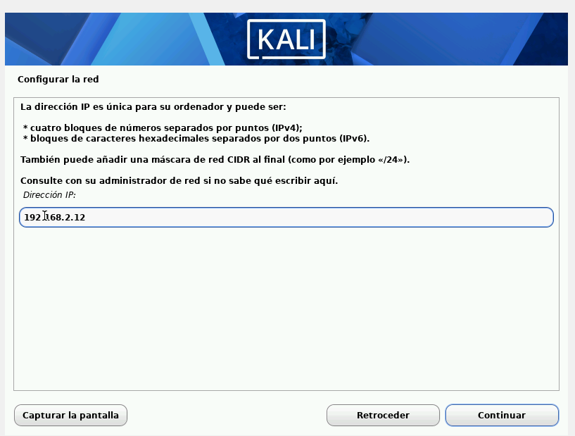
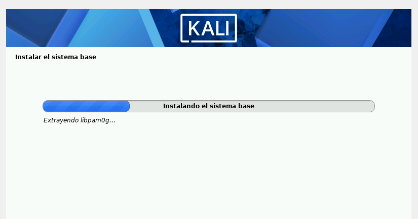
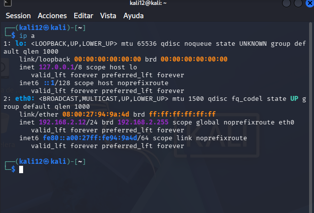
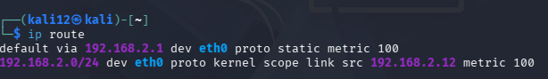
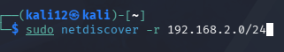
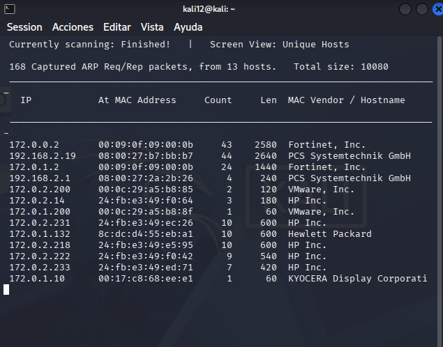
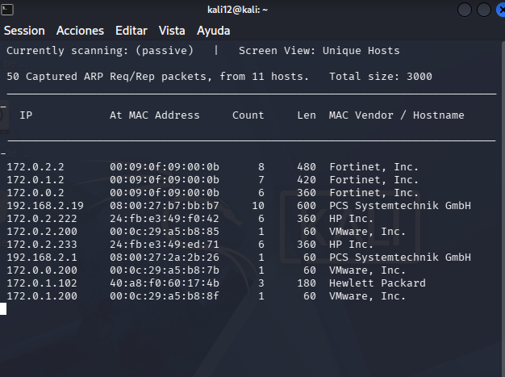
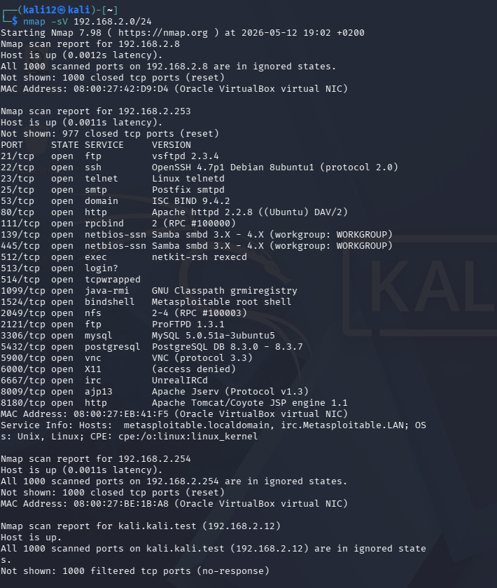

# AA1-ExploracioXarxa
---

CONFIGURACIÓ DE XARXA IP

COMPROVACIONS DE XARXA
---

---
## PASSIU

---

## ACTIU

---

## DIFERENCIA ENTRE UN METODE I UN ALTRE

El mètode passiu consisteix a recopilar informació sense interactuar directament amb els sistemes de l'objectiu. L'objectiu és passar desapercebut mentre es recopila informació pública o disponible en fonts

El mètode actiu implica interactuar directament amb el sistema o la xarxa objectiu per obtenir informació detallada. Això implica enviar paquets de dades i esperar resposta

---

## NMAP

